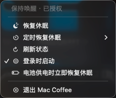

<h1 align="center">
  <a href="https://github.com/Elliotwu-7/Mac-Coffee">
    
  </a>
</h1>

<div align="center">
  Mac Coffee
  <br />
  一个原生 macOS 菜单栏工具，用来保持 Mac 唤醒、按计划恢复正常休眠，并在切到电池供电时自动安全回退。
  <br />
  <br />
  <div align="center">
<p align="center">
  <a href="https://linux.do" alt="LINUX DO">
    
  </a>
</p>
    
  <a href="README.md">English</a>
  ·
  <a href="https://github.com/Elliotwu-7/Mac-Coffee/releases">下载 DMG</a>
  ·
  <a href="https://github.com/Elliotwu-7/Mac-Coffee/issues/new?assignees=&labels=bug&template=01_BUG_REPORT.md&title=bug%3A+">报告问题</a>
  ·
  <a href="https://github.com/Elliotwu-7/Mac-Coffee/issues/new?assignees=&labels=enhancement&template=02_FEATURE_REQUEST.md&title=feat%3A+">功能建议</a>
</div>

<div align="center">
<br />

[](LICENSE)
[](https://github.com/Elliotwu-7/Mac-Coffee/releases)
[](https://github.com/Elliotwu-7/Mac-Coffee/issues?q=is%3Aissue+is%3Aopen+label%3A%22help+wanted%22)

</div>

## 项目简介

Mac Coffee 是一个轻量的原生 macOS 菜单栏应用，让你不用打开终端，也能快速切换“保持唤醒”和“恢复正常休眠”。它面向日常使用场景：操作简单，同时保留定时恢复、电池供电自动恢复休眠、登录时启动等安全保护能力。

## 运行截图



## 功能特性

- 原生菜单栏体验，状态区更紧凑，右键菜单更清爽
- 一键切换保持唤醒 / 恢复正常休眠
- 支持预设时长后恢复休眠，也支持指定日期与时间恢复
- 支持“切到电池供电后立即恢复休眠”
- 支持登录时启动
- helper 首次安装授权后，后续切换通常无需重复输入密码

## 安装

### 下载发行版

1. 从最新的 [GitHub Release](https://github.com/Elliotwu-7/Mac-Coffee/releases) 下载 `MacCoffee.dmg`
2. 打开 DMG
3. 将 `Mac Coffee.app` 拖入 `Applications`
4. 从 `Applications` 启动应用

如果 macOS 提示“App 已损坏”或“无法打开”，通常是因为当前发行版还没有签名，被 Gatekeeper 拦截了。可以先移除隔离属性，再重新打开：

```sh
sudo xattr -rd com.apple.quarantine /Applications/"Mac Coffee.app"
```

也可以前往 `系统设置 > 隐私与安全性`，在底部允许这个被拦截的应用，然后再次启动。

### 从源码构建

环境要求：

- macOS 13 或更高版本
- Xcode Command Line Tools（`xcode-select --install`）
- 首次切换时允许管理员授权安装 helper

```sh
cd /Users/elliotwu/MacCoffee
chmod +x build.sh install.sh package_dmg.sh
./build.sh
./install.sh
```

如需本地生成 DMG：

```sh
./package_dmg.sh
open dist/MacCoffee.dmg
```

## 使用说明

Mac Coffee 常驻菜单栏，尽量做到开箱即用：

- 需要保持唤醒时，直接开启 keep-awake 模式
- 可以选择一个倒计时，或指定某个日期与时间恢复正常休眠
- 如果你希望拔掉电源后立刻恢复休眠，可以开启电池保护
- 如果想每次开机都可用，可以打开登录时启动

首次切换时，macOS 会请求管理员授权安装 helper。安装完成后，只要 helper 没被移除，后续切换通常不会再次弹出密码框。

## 自动发布

仓库已经包含 GitHub Actions release workflow。以后只要推送类似 `v1.0.1` 的 tag，就会自动构建应用并上传 `MacCoffee.dmg` 到对应 Release。

## 贡献

欢迎提交 issue、想法和 pull request。如果你想一起完善它，可以先阅读 [docs/CONTRIBUTING.md](docs/CONTRIBUTING.md)。

## 安全

本项目按开源项目常规方式提供，不附带任何保证。如发现安全问题，请参考 [docs/SECURITY.md](docs/SECURITY.md) 中的方式联系。

## 许可证

本项目基于 [MIT License](LICENSE) 开源。

## 致谢

- [dec0dOS/amazing-github-template](https://github.com/dec0dOS/amazing-github-template)
- Apple 的 macOS 开发工具与系统框架
- 感谢 [Linux.do](https://linux.do/) 社区的讨论、反馈与早期支持
